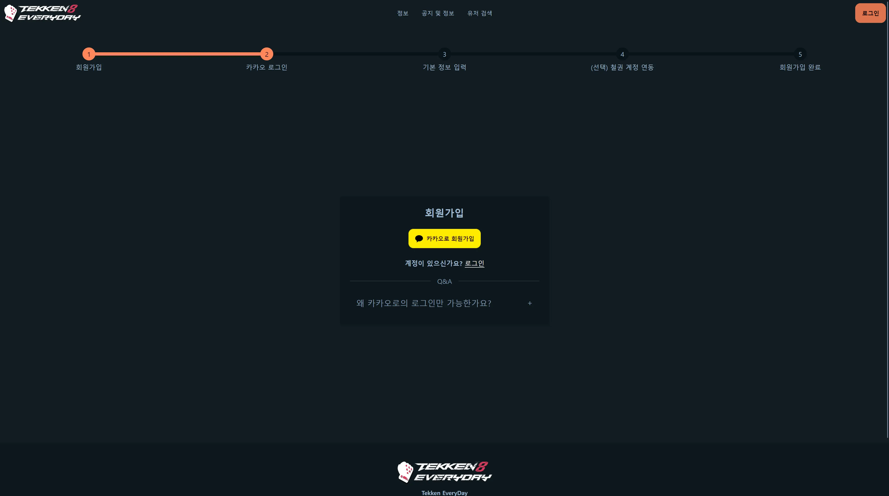
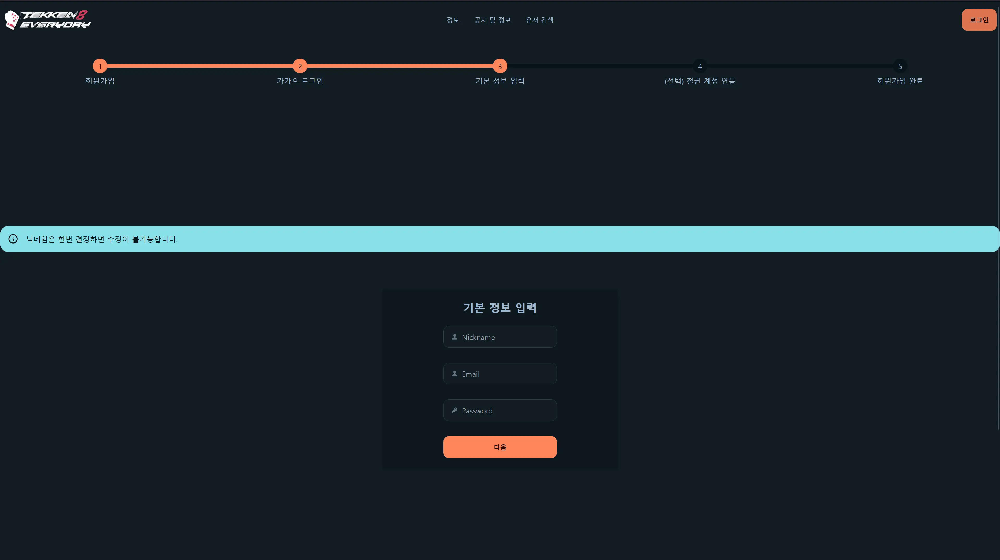
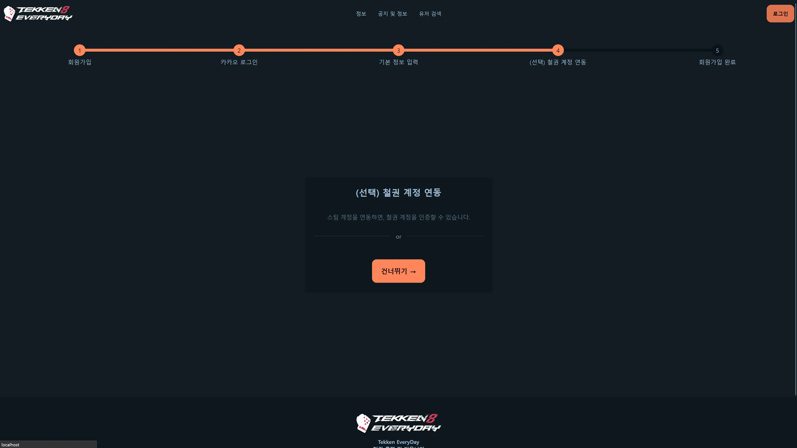
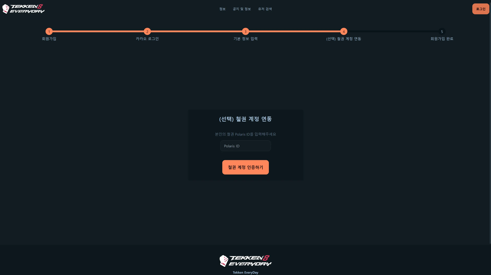
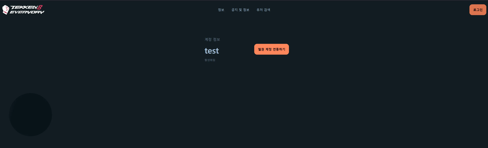
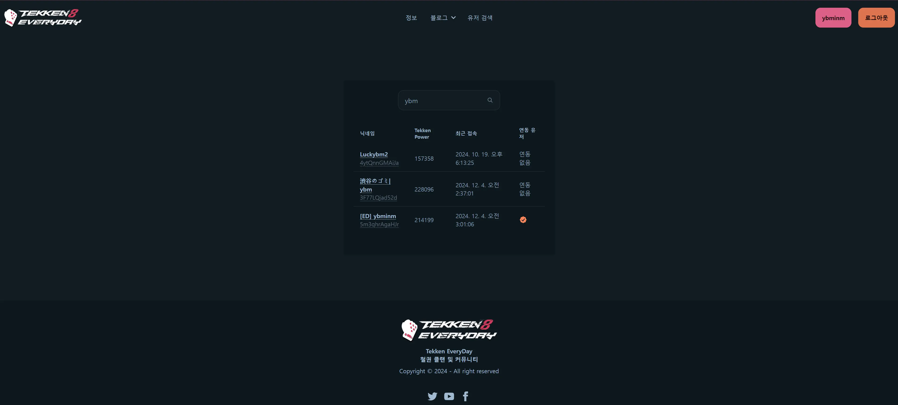
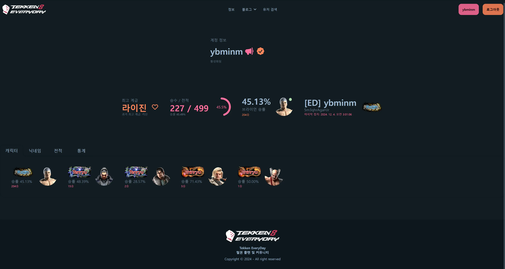
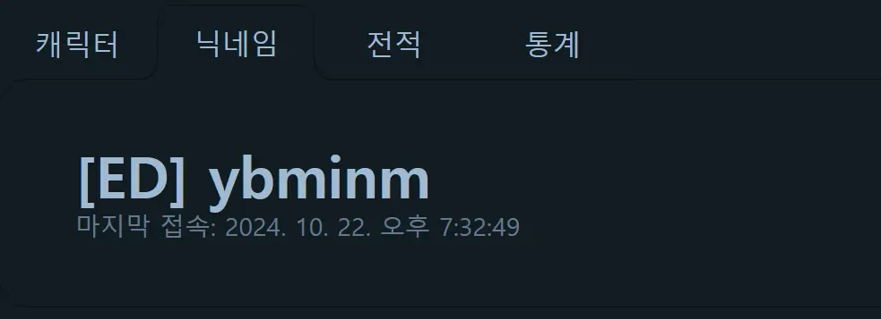
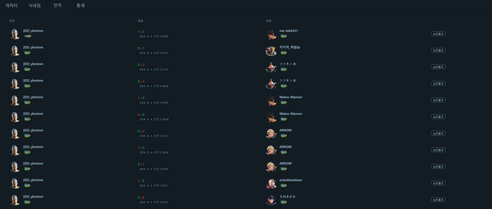

- [개요](#개요)
- [Tekken EveryDay 가오픈](#tekken-everyday-가오픈)
- [기능](#기능)
  - [로그인 및 회원 가입](#로그인-및-회원-가입)
    - [회원 가입 방법](#회원-가입-방법)
      - [1. **카카오 계정 연동**](#1-카카오-계정-연동)
      - [2. **계정 닉네임 결정**](#2-계정-닉네임-결정)
      - [3. **(선택 사항) 스팀 계정 연동**](#3-선택-사항-스팀-계정-연동)
      - [4. 회원가입 완료](#4-회원가입-완료)
  - [랭크매치 정보](#랭크매치-정보)
    - [랭크 정보 기준](#랭크-정보-기준)
    - [랭크 유저 검색](#랭크-유저-검색)
    - [랭크 유저 정보](#랭크-유저-정보)
  - [기타](#기타)

## 개요

안녕하세요. **철권 클랜 Tekken EveryDay**의 총무이자 [tk-everyday.site](https://tk-everyday.site/)의 개발자인 [ybminm](https://tk-everyday.site/user/1)입니다.

철권 클랜 사이트이자 커뮤니티로의 tk-everyday.site의 초기 기획과는 비용 및 운영 관리에서의 불확실성으로 변경되었지만,
이제는 새로운 모습으로 다시 시작하게 되었습니다. 현재로서는 클랜 사이트이자 랭크 연동 정도의 기능을 제공하고 있지만,

차후 클랜, 클랜 내전 및 토너먼트, 리그 포인트 관리 등의 기능을 추가할 예정입니다.

## Tekken EveryDay 가오픈

2024년 12월 5일, Tekken EveryDay가 새로운 모습으로 재단장하였습니다.

사이트내 에서 카카오톡을 통한 로그인 및 회원가입을 지원하고 있고, 스팀 로그인을 통한 철권 계정 연동을 지원합니다.

## 기능

**기능 설명에 앞서 본 사이트는 랭크 유저의 정보를 파악하기 위해 반다이 남코의 철권 8 게임 서버에 게임 클라이언트 외 비정상적인 외부 접속을 일절 진행한 적이 없으며, 랭크 정보는 기본적으로 [wank.wavu.wiki](https://wank.wavu.wiki)의 정보에 의거하고 있음을 밝힙니다.**

### 로그인 및 회원 가입

현재 사이트에서는 추가적인 비용이 발생하지 않는 방향으로, 1인 다중 계정 생성을 최소화하는 방안으로 **카카오 계정으로 통한 로그인 및 회원 가입만**을 지원하고 있습니다.

또한, **스팀 계정 연동**을 통해 철권 계정을 사이트 계정에 연동할 수 있습니다.

_현재는 스팀 철권 계정의 연동만을 지원합니다._

#### 회원 가입 방법

##### 1. **카카오 계정 연동**

: [회원가입](https://tk-everyday.site/signup) 페이지에서 카카오 계정으로 로그인을 진행하면, 이후 차례대로 계정 추가 정보를 입력하도록 안내됩니다.


##### 2. **계정 닉네임 결정**

: 계정 추가 정보를 입력할때 주의할 점은 한 번 정한 닉네임은 바꿀 수 없다는 점을 명심해주세요.


##### 3. **(선택 사항) 스팀 계정 연동**

: 계정 추가 정보 입력 후, 철권 계정을 연동을 위해 스팀 계정 연동을 진행할 수 있습니다.

스팀 계정을 연동한 뒤에는 철권 Polaris ID를 입력하면, 스팀 계정에 연결된 철권 계정인지를 확인하고 철권 계정을 사이트 계정에 인증할 수 있습니다.


##### 4. 회원가입 완료

: 이제 사이트에 로그인이 가능합니다. 추후에도 철권 계정 인증은 로그인 후 [계정 정보](https://tk-everyday.site/profile) 페이지에서 가능합니다.



### 랭크매치 정보

#### 랭크 정보 기준

기본적으로 랭크 정보는 2024년 11월 7일 부터 [wank.wavu.wiki](https://wank.wavu.wiki/api)의 API를 통해서 fetch한 정보를 자체 DB로 가져오고 있습니다. 따라서 **해당 일자 이후로 랭크를 돌리지 않은 유저/캐릭의 정보**는 확인할 수 없습니다. 또한 해당 일자 이전의 기록은 **불완전** 혹은 **존재하지 않습니다**.

현재 **철권 닉네임 변경 이력 접속 날짜** 업데이트 query의 성능 문제로 최근 접속 날짜가 철권 닉네임 별로 제공되고 있지 않습니다. 철권 유저 자체의 최신 접속 시점은 업데이트되고 있습니다.

또한 계급 정보는 **각 판이 시작할 시점의 계급**으로 기록되고 있기에 승단 혹은 강등전 이후에 해당 캐릭터로의 랭크 전적이 없다면 변경된 계급이 사이트에 기록되지 않습니다.

**예시**

| 시점                   | 실제 | 사이트 DB |
| ---------------------- | ---- | --------- |
| 승단 매치 전           | 1단  | 1단       |
| 승단 매치 승리 후      | 2단  | 1단       |
| 이후 해당 캐릭 매치 후 | 2단  | 2단       |

#### 랭크 유저 검색

상위메뉴바의 유저 검색을 누르고 닉네임을 검색하면 유저들이 띄워지게 됩니다. 아래 사진에서처럼 연동이 된 철권 계정의 경우 체크 아이콘으로 별도 표시됩니다. 검색 내용이 적용되지 않을 경우, 엔터를 통해 검색을 진행해주세요.

Polaris ID를 알고 있는 유저에 대해서는

```
https://tk-everyday.site/tekkenUser/player/{Polaris ID}
```

로 접속하면 해당 유저의 정보를 확인할 수 있습니다.

#### 랭크 유저 정보

철권 계정이 연동된 유저의 경우 아래의 사진과 같이 사이트 계정 정보와 함께 철권 계정 정보를 확인할 수 있습니다.

사이트에서 제공하는 정보는 다음과 같습니다. _(2024년 12월 5일 기준)_

본인 캐릭터별 랭크 및 승률,
닉네임 변경 이력 **(날짜 불완전)**,

랭크 전적 **(캐릭별 필터 현재 미제공)**,

**[추후] 철권 계정 통계 및 포인트, 클랜 정보 (개발 중)**
: 해당 기능은 추후 추가될 예정이며, 사이트 계정 유저 중 클랜에 소속된 유저에 한해 제공될 예정입니다.

### 기타

개발 과정 및 기능 추가에 대한 의견은 [ybminm](https://discord.com/users/426666175448219658)에게 연락해주시면 감사하겠습니다.

추후 개발 블로그와 공지를 통해 안내드리도록 하겠습니다.
